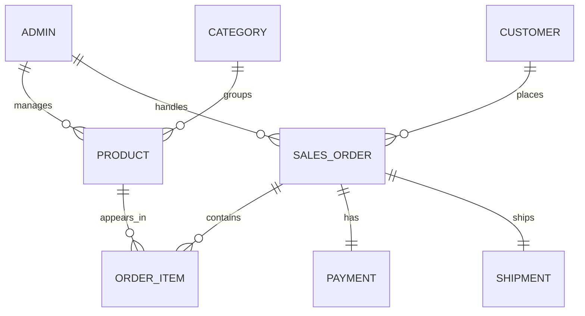

# BIIT 1301 Database Programming

## Group Project Final Report

**Project Title:** E-Commerce System  
**Semester:** Semester II, 2025/2026  
**Prepared By:** Group Members

| Matric Number | Name | Email | Phone |
| --- | --- | --- | --- |
| 2217535 | MUHAMMAD AMIN BIN MOHAMAD RIZAL | 4M1Nrizal@gmail.com | 107996078 |
| 2115617 | AMIR FARHAN BIN GHAFFAR | amfarhnn@gmail.com | 60199633495 |
| 2517547 | NIK MUHAMAD AQIL | aqilnick09@gmail.com | 60174170702 |
| 2215087 | CHE KU MUHAMMAD HAIQAL | ckmh143@gmail.com | 013-970-3566 |

## Table Of Contents

1. Project Scenario
2. Entity Relationship Diagram
3. Data Dictionary
4. Create Table Command
5. Insert Command
6. SQL Statements
7. Procedures and Functions
8. Web Application
9. Members' Contribution
10. Appendix

## 1.0 Project Scenario

The E-Commerce System is designed for an online store that sells products from multiple categories such as electronics, computers, mobile accessories, fashion, home appliances, books, toys and groceries. Customers can register with the store, browse products, place orders, make payments and track shipments. Admin users manage products, monitor stock, handle customer orders and update the progress of each order.

This database is needed because an e-commerce business handles many connected records. Customer details must be linked to orders, each order must contain one or more order items, every order requires a payment record, and every confirmed order needs shipment tracking. A structured database helps the company reduce duplicate data, prevent invalid records, track product inventory, calculate sales and produce useful reports for decision-making.

## 2.0 Entity Relationship Diagram

The ER diagram source is available in `ERD.mmd`.



### Relationship Explanation

| Relationship | Type | Explanation |
| --- | --- | --- |
| ADMIN to PRODUCT | One-to-many | One admin can manage many products. |
| ADMIN to SALES_ORDER | One-to-many | One admin can handle many customer orders. |
| CUSTOMER to SALES_ORDER | One-to-many | One customer can place many orders. |
| CATEGORY to PRODUCT | One-to-many | One category can contain many products. |
| SALES_ORDER to ORDER_ITEM | One-to-many | One order can contain many products. |
| PRODUCT to ORDER_ITEM | One-to-many | One product can appear in many order records. |
| SALES_ORDER to PAYMENT | One-to-one | One order has one payment record. |
| SALES_ORDER to SHIPMENT | One-to-one | One order has one shipment record. |

## 3.0 Data Dictionary

The full data dictionary is available in `REPORT/Data_Dictionary.md`.

### 3.1 ADMIN

| Attribute Name | Data Type | Size | Null |
| --- | --- | --- | --- |
| adminID | NUMBER | 4 | NO (PK) |
| adminName | VARCHAR2 | 50 | NO |
| adminEmail | VARCHAR2 | 60 | NO (UK) |
| adminContact | VARCHAR2 | 15 | NO |
| adminPassword | VARCHAR2 | 30 | NO |

### 3.2 CUSTOMER

| Attribute Name | Data Type | Size | Null |
| --- | --- | --- | --- |
| customerID | NUMBER | 4 | NO (PK) |
| customerName | VARCHAR2 | 60 | NO |
| customerEmail | VARCHAR2 | 60 | NO (UK) |
| customerPhone | VARCHAR2 | 15 | NO |
| customerAddress | VARCHAR2 | 120 | NO |
| customerPassword | VARCHAR2 | 30 | NO |
| joinDate | DATE | - | NO |

### 3.3 CATEGORY

| Attribute Name | Data Type | Size | Null |
| --- | --- | --- | --- |
| categoryID | NUMBER | 3 | NO (PK) |
| categoryName | VARCHAR2 | 40 | NO (UK) |
| categoryDescription | VARCHAR2 | 120 | YES |

### 3.4 PRODUCT

| Attribute Name | Data Type | Size | Null |
| --- | --- | --- | --- |
| productID | NUMBER | 4 | NO (PK) |
| categoryID | NUMBER | 3 | NO (FK) |
| adminID | NUMBER | 4 | NO (FK) |
| productName | VARCHAR2 | 60 | NO |
| productBrand | VARCHAR2 | 40 | YES |
| unitPrice | NUMBER | 8,2 | NO |
| stockQty | NUMBER | 5 | NO |
| productStatus | VARCHAR2 | 20 | NO |
| createdDate | DATE | - | NO |

### 3.5 SALES_ORDER

| Attribute Name | Data Type | Size | Null |
| --- | --- | --- | --- |
| orderID | NUMBER | 5 | NO (PK) |
| customerID | NUMBER | 4 | NO (FK) |
| adminID | NUMBER | 4 | NO (FK) |
| orderDate | DATE | - | NO |
| orderStatus | VARCHAR2 | 20 | NO |
| subtotal | NUMBER | 10,2 | NO |
| deliveryFee | NUMBER | 6,2 | NO |
| totalAmount | NUMBER | 10,2 | NO |

### 3.6 ORDER_ITEM

| Attribute Name | Data Type | Size | Null |
| --- | --- | --- | --- |
| orderItemID | NUMBER | 5 | NO (PK) |
| orderID | NUMBER | 5 | NO (FK) |
| productID | NUMBER | 4 | NO (FK) |
| quantity | NUMBER | 4 | NO |
| unitPrice | NUMBER | 8,2 | NO |
| lineTotal | NUMBER | 10,2 | NO |

### 3.7 PAYMENT

| Attribute Name | Data Type | Size | Null |
| --- | --- | --- | --- |
| paymentID | NUMBER | 5 | NO (PK) |
| orderID | NUMBER | 5 | NO (FK, UK) |
| customerID | NUMBER | 4 | NO (FK) |
| paymentDate | DATE | - | NO |
| paymentMethod | VARCHAR2 | 20 | NO |
| paymentStatus | VARCHAR2 | 20 | NO |
| paymentAmount | NUMBER | 10,2 | NO |

### 3.8 SHIPMENT

| Attribute Name | Data Type | Size | Null |
| --- | --- | --- | --- |
| shipmentID | NUMBER | 5 | NO (PK) |
| orderID | NUMBER | 5 | NO (FK, UK) |
| courierName | VARCHAR2 | 40 | NO |
| trackingNo | VARCHAR2 | 30 | YES |
| shippingAddress | VARCHAR2 | 120 | NO |
| shippedDate | DATE | - | YES |
| deliveredDate | DATE | - | YES |
| shipmentStatus | VARCHAR2 | 20 | NO |

## 4.0 Create Table Command

The full DDL script is available in `SCRIPT/ecommerce_table.sql`.

The script includes:

- Drop table statements with `CASCADE CONSTRAINTS`
- Create table statements for all 8 tables
- Primary key constraints
- Foreign key constraints
- Unique constraints
- Check constraints for status, amount and stock values

### Example Create Table Statement

```sql
CREATE TABLE product (
  productID     NUMBER(4) NOT NULL,
  categoryID    NUMBER(3) NOT NULL,
  adminID       NUMBER(4) NOT NULL,
  productName   VARCHAR2(60) NOT NULL,
  productBrand  VARCHAR2(40),
  unitPrice     NUMBER(8,2) NOT NULL,
  stockQty      NUMBER(5) NOT NULL,
  productStatus VARCHAR2(20) NOT NULL,
  createdDate   DATE DEFAULT SYSDATE NOT NULL,
  CONSTRAINT product_productID_PK PRIMARY KEY (productID),
  CONSTRAINT product_categoryID_FK FOREIGN KEY (categoryID)
    REFERENCES category (categoryID),
  CONSTRAINT product_adminID_FK FOREIGN KEY (adminID)
    REFERENCES admin (adminID),
  CONSTRAINT product_price_CK CHECK (unitPrice >= 0),
  CONSTRAINT product_stock_CK CHECK (stockQty >= 0),
  CONSTRAINT product_status_CK CHECK (productStatus IN ('AVAILABLE', 'LOW STOCK', 'OUT OF STOCK', 'DISCONTINUED'))
);
```

## 5.0 Insert Command

The full data population script is available in `SCRIPT/ecommerce_data.sql`.

Each table contains at least 10 records:

| Table | Number of Records |
| --- | ---: |
| admin | 10 |
| customer | 10 |
| category | 10 |
| product | 12 |
| sales_order | 11 |
| order_item | 22 |
| payment | 11 |
| shipment | 11 |

### Example Insert Statements

```sql
INSERT INTO category VALUES (201, 'Electronics', 'Electronic gadgets and smart devices');
INSERT INTO product VALUES (3001, 201, 1001, 'Wireless Mouse', 'TechGear', 49.90, 120, 'AVAILABLE', TO_DATE('2026-02-01', 'YYYY-MM-DD'));
INSERT INTO sales_order VALUES (4001, 2001, 1001, TO_DATE('2026-03-01', 'YYYY-MM-DD'), 'DELIVERED', 238.90, 10.00, 248.90);
INSERT INTO order_item VALUES (5001, 4001, 3001, 1, 49.90, 49.90);
INSERT INTO payment VALUES (6001, 4001, 2001, TO_DATE('2026-03-01', 'YYYY-MM-DD'), 'CARD', 'PAID', 248.90);
```

## 6.0 SQL Statements

The full SQL statement script is available in `SCRIPT/ecommerce_queries.sql`.

### 6.1 Select Statements

#### 6.1.1 Display customers with the highest total spending

```sql
SELECT c.customerID,
       c.customerName,
       SUM(p.paymentAmount) AS totalSpent
FROM customer c
JOIN payment p ON c.customerID = p.customerID
WHERE p.paymentStatus = 'PAID'
GROUP BY c.customerID, c.customerName
HAVING SUM(p.paymentAmount) = (
  SELECT MAX(customerTotal)
  FROM (
    SELECT SUM(paymentAmount) AS customerTotal
    FROM payment
    WHERE paymentStatus = 'PAID'
    GROUP BY customerID
  )
);
```

#### 6.1.2 Display available products with category names

```sql
SELECT p.productID,
       p.productName,
       c.categoryName,
       p.unitPrice,
       p.stockQty,
       p.productStatus
FROM product p
JOIN category c ON p.categoryID = c.categoryID
WHERE p.productStatus IN ('AVAILABLE', 'LOW STOCK')
ORDER BY c.categoryName, p.productName;
```

#### 6.1.3 Display all orders made by customer 2001

```sql
SELECT so.orderID,
       c.customerName,
       so.orderDate,
       so.orderStatus,
       so.totalAmount
FROM sales_order so
JOIN customer c ON so.customerID = c.customerID
WHERE so.customerID = 2001
ORDER BY so.orderDate;
```

#### 6.1.4 Display order item details for order 4001

```sql
SELECT so.orderID,
       p.productName,
       oi.quantity,
       oi.unitPrice,
       oi.lineTotal
FROM sales_order so
JOIN order_item oi ON so.orderID = oi.orderID
JOIN product p ON oi.productID = p.productID
WHERE so.orderID = 4001;
```

#### 6.1.5 Display products that need restocking

```sql
SELECT productID,
       productName,
       stockQty,
       productStatus
FROM product
WHERE stockQty < 10
ORDER BY stockQty ASC;
```

### 6.2 Insert Statement

```sql
INSERT INTO product
VALUES (3013, 208, 1009, 'SQL Practice Workbook', 'LearnPro', 55.00, 35, 'AVAILABLE', SYSDATE);
```

### 6.3 Update Statement

```sql
UPDATE product
SET stockQty = stockQty + 25,
    productStatus = 'AVAILABLE'
WHERE productID = 3008;
```

### 6.4 Delete Statement

```sql
DELETE FROM product
WHERE productID = 3013;
```

## 7.0 Procedures And Functions

The procedure script is available in `SCRIPT/ecommerce_procedures.sql`. The function script is available in `SCRIPT/ecommerce_functions.sql`.

### 7.1 Procedures

#### 7.1.1 Procedure: `add_product`

This procedure allows an admin to add a new product.

```sql
CREATE OR REPLACE PROCEDURE add_product (
  p_productID     IN product.productID%TYPE,
  p_categoryID    IN product.categoryID%TYPE,
  p_adminID       IN product.adminID%TYPE,
  p_productName   IN product.productName%TYPE,
  p_productBrand  IN product.productBrand%TYPE,
  p_unitPrice     IN product.unitPrice%TYPE,
  p_stockQty      IN product.stockQty%TYPE,
  p_productStatus IN product.productStatus%TYPE
) IS
BEGIN
  INSERT INTO product (
    productID, categoryID, adminID, productName, productBrand,
    unitPrice, stockQty, productStatus, createdDate
  )
  VALUES (
    p_productID, p_categoryID, p_adminID, p_productName, p_productBrand,
    p_unitPrice, p_stockQty, p_productStatus, SYSDATE
  );
  DBMS_OUTPUT.PUT_LINE('Product ' || p_productName || ' has been added successfully.');
END add_product;
/
```

#### 7.1.2 Procedure: `list_customer_orders`

This procedure retrieves all orders for a selected customer using a cursor.

```sql
CREATE OR REPLACE PROCEDURE list_customer_orders (
  p_customerID IN customer.customerID%TYPE
) IS
  v_customerName customer.customerName%TYPE;

  CURSOR order_cur IS
    SELECT so.orderID, so.orderDate, so.orderStatus, so.totalAmount, p.paymentStatus
    FROM sales_order so
    JOIN payment p ON so.orderID = p.orderID
    WHERE so.customerID = p_customerID
    ORDER BY so.orderDate;
BEGIN
  SELECT customerName
  INTO v_customerName
  FROM customer
  WHERE customerID = p_customerID;

  DBMS_OUTPUT.PUT_LINE('Orders for customer: ' || v_customerName);

  FOR order_rec IN order_cur LOOP
    DBMS_OUTPUT.PUT_LINE('Order ID: ' || order_rec.orderID ||
      ' | Date: ' || TO_CHAR(order_rec.orderDate, 'DD-MON-YYYY') ||
      ' | Order Status: ' || order_rec.orderStatus ||
      ' | Payment Status: ' || order_rec.paymentStatus ||
      ' | Total: RM ' || order_rec.totalAmount);
  END LOOP;
END list_customer_orders;
/
```

### 7.2 Functions

#### 7.2.1 Function: `customer_discount`

This function calculates a discount rate based on a customer's paid spending.

```sql
CREATE OR REPLACE FUNCTION customer_discount (
  p_customerID IN customer.customerID%TYPE
) RETURN NUMBER IS
  v_totalSpent NUMBER(10,2);
  v_discount   NUMBER(4,2);
BEGIN
  SELECT NVL(SUM(paymentAmount), 0)
  INTO v_totalSpent
  FROM payment
  WHERE customerID = p_customerID
    AND paymentStatus = 'PAID';

  IF v_totalSpent >= 500 THEN
    v_discount := 0.10;
  ELSIF v_totalSpent >= 250 THEN
    v_discount := 0.05;
  ELSE
    v_discount := 0.02;
  END IF;

  RETURN v_discount;
END customer_discount;
/
```

#### 7.2.2 Function: `order_total`

This function calculates the current total amount of an order from its order items and delivery fee.

```sql
CREATE OR REPLACE FUNCTION order_total (
  p_orderID IN sales_order.orderID%TYPE
) RETURN NUMBER IS
  v_itemTotal   NUMBER(10,2);
  v_deliveryFee sales_order.deliveryFee%TYPE;
  v_total       NUMBER(10,2);
BEGIN
  SELECT NVL(SUM(lineTotal), 0)
  INTO v_itemTotal
  FROM order_item
  WHERE orderID = p_orderID;

  SELECT deliveryFee
  INTO v_deliveryFee
  FROM sales_order
  WHERE orderID = p_orderID;

  v_total := v_itemTotal + v_deliveryFee;
  RETURN v_total;
END order_total;
/
```

## 8.0 Web Application

The web application is available in the `WEB` folder. It is written in PHP and uses Oracle OCI8 functions to connect to the database.

### 8.1 Web Application Files

| File | Function |
| --- | --- |
| `WEB/config.php` | Stores Oracle username, password and service name. |
| `WEB/lib.php` | Handles connection, SQL execution, PL/SQL execution and layout. |
| `WEB/index.php` | Dashboard with summary and recent orders. |
| `WEB/products.php` | Insert, update and delete product records. |
| `WEB/orders.php` | Display orders and update order status. |
| `WEB/customers.php` | Display customer purchase summaries. |
| `WEB/procedures.php` | Execute `add_product` and `list_customer_orders`. |
| `WEB/functions_demo.php` | Execute `customer_discount` and `order_total`. |
| `WEB/assets/style.css` | Web application design. |

### 8.2 Web Application Screens

Add screenshots after running the system:

1. Dashboard page
2. Products page
3. Orders page
4. Customers page
5. Procedures page
6. Functions page

### 8.3 Web Database Operations

| Operation | Page | Database Action |
| --- | --- | --- |
| Connect | All pages | Uses `oci_connect()` in `lib.php`. |
| Insert | `products.php` | Inserts a new product. |
| Update | `products.php`, `orders.php` | Updates product stock/status and order status. |
| Delete | `products.php` | Deletes a product record. |
| Procedure | `procedures.php` | Calls `add_product` and `list_customer_orders`. |
| Function | `functions_demo.php` | Calls `customer_discount` and `order_total`. |

## 9.0 Members' Contribution

| Name | Contribution |
| --- | --- |
| MUHAMMAD AMIN BIN MOHAMAD RIZAL | Project scenario, report formatting and presentation preparation. |
| AMIR FARHAN BIN GHAFFAR | ER diagram, data dictionary and database relationship design. |
| NIK MUHAMAD AQIL | DDL/DML scripts, sample data and SQL query statements. |
| CHE KU MUHAMMAD HAIQAL | Procedures, functions and web application development. |

## 10.0 Appendix

### Appendix A: Project File List

| File | Description |
| --- | --- |
| `ERD.mmd` | Mermaid ER diagram. |
| `README_Database_Design.md` | Database design overview. |
| `REPORT/Data_Dictionary.md` | Data dictionary. |
| `REPORT/E-Commerce_System_Final_Report.md` | Final report draft. |
| `SCRIPT/ecommerce_table.sql` | Drop and create table commands. |
| `SCRIPT/ecommerce_data.sql` | Sample data insert commands. |
| `SCRIPT/ecommerce_queries.sql` | SQL select, insert, update and delete commands. |
| `SCRIPT/ecommerce_procedures.sql` | PL/SQL procedures. |
| `SCRIPT/ecommerce_functions.sql` | PL/SQL functions. |
| `SCRIPT/run_all.sql` | Runs the main setup scripts in order. |
| `WEB/*` | PHP web application. |

### Appendix B: Execution Order

Run the SQL files in this order:

```text
1. SCRIPT/ecommerce_table.sql
2. SCRIPT/ecommerce_data.sql
3. SCRIPT/ecommerce_procedures.sql
4. SCRIPT/ecommerce_functions.sql
5. SCRIPT/ecommerce_queries.sql
```

The setup files can also be run using:

```text
SCRIPT/run_all.sql
```

### Appendix C: Web Application Setup

Update the Oracle credentials in `WEB/config.php`:

```php
define('DB_USERNAME', 'your_username');
define('DB_PASSWORD', 'your_password');
define('DB_CONNECTION_STRING', 'localhost/XEPDB1');
```

Then place the `WEB` folder in a PHP server directory such as XAMPP `htdocs`.
